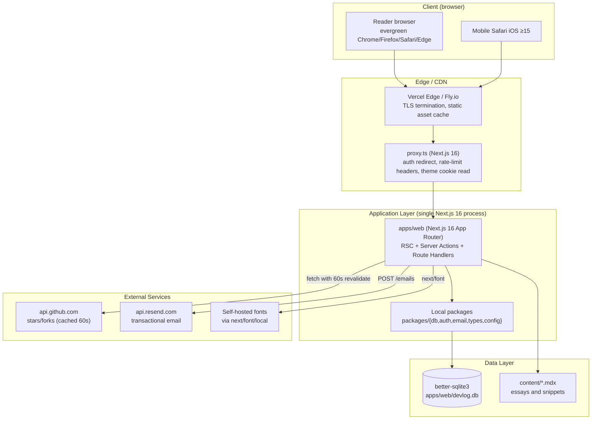

# `/dev/log` — Master Project Architecture Document (PAD) v1.0

**Project:** `/dev/log — Notes from a Programmer's Desk`
**Classification:** Internal Engineering Reference
**Status:** DEFINITIVE, PRODUCTION-LOCKED BLUEPRINT
**Companion Document:** `Project_Requirements_Document.md` (PRD), `Master_Execution_Plan.md` (MEP)
**Last Updated:** 2026-08-26
**Audience:** Senior Engineers, Tech Leads, DevOps, Onboarding Engineers, AI Coding Agents
**Rule:** Every architectural decision in this document traces to a specific rationale.
       Nothing is here "because it's popular."

---

## Revision Block — v1.0

Every change is tagged with its source: `[RES]` = validated by web research,
`[SR]` = self-review, `[CA]` = critical analysis, `[SYN]` = synthesis,
`[SAN]` = sanitization pass, `[AUTH]` = auth alignment.

- `[SYN]` Initial PAD generated from PRD v1.0 + landing_page_mockup.html + skills/ folder (skills/nextjs16-react19-tailwind4-better-auth-monorepo, skills/nextjs16-react19-tailwindv4-trpcv11-drizzle-better-auth, skills/project-architecture-document-md).

---

## Table of Contents

1. [System Overview & Decisions](#1-system-overview--decisions)
2. [High-Level System Topology](#2-high-level-system-topology)
3. [Application Architecture](#3-application-architecture)
4. [Data Architecture](#4-data-architecture)
5. [Design System Reference](#5-design-system-reference)
6. [Security Architecture](#6-security-architecture)
7. [Worker / Background Service Architecture](#7-worker--background-service-architecture)
8. [Testing Strategy](#8-testing-strategy)
9. [Build & Deployment](#9-build--deployment)
10. [Developer Handbook](#10-developer-handbook)
11. [Known Issues & Outstanding Tasks](#11-known-issues--outstanding-tasks)
12. [Key Files Reference](#12-key-files-reference)
13. [Glossary](#13-glossary)

---

## 1. System Overview & Decisions

### 1.1 Document Metadata & Purpose

This Project Architecture Document (PAD) is the single source of truth for how `/dev/log` is structured, why it is structured that way, and what invariants must hold as it evolves. It is a companion to the PRD (which defines *what* we are building and *why* the product exists) and the MEP (which defines *in what order* we build it).

This document is for:

- **Onboarding engineers** — read §1, §2, §3 before touching any file. Read §6 before any auth/security work.
- **AI coding agents** — read §1, §3, §9, §11 before any code generation. §3.2 is the annotated directory tree.
- **Debugging** — start at §11 (Known Issues) and §10 (Developer Handbook → Common Commands).
- **Reviewing tech choices** — read §1.2 (Tech Stack) and §1.3 (ADRs). The ADRs link every consequential decision to its rationale.

This PAD is *current state*, not a roadmap. Future plans live in the PRD's Open Questions or in a future ROADMAP.md.

### 1.2 Technology Stack Summary

Definitive. Every choice is locked. Versions are pinned to the floor of what we accept; the ceiling is the latest stable as of the date the dependency was added.

| Layer | Technology | Version | Key Rationale |
|-------|------------|---------|---------------|
| Package manager | pnpm | ≥9.15.0 | Strict node_modules layout, monorepo workspaces, fast installs, lockfile discipline. |
| Monorepo orchestrator | Turborepo | ≥2.4.0 | Cached task execution, dependency-aware task graph, single-binary install. |
| Web framework | Next.js | ≥16.0.0 (current 16.2.x) | App Router, Server Components, Server Actions, on-demand ISR, `proxy.ts` (replaces `middleware.ts`), Turbopack. |
| UI runtime | React | ≥19.0.0 (current 19.2.x) | Required by Next.js 16. `use()`, `useFormState`, `useOptimistic`, `useEffectEvent`. |
| Language | TypeScript | ≥5.9.0 | `strict`, `noUncheckedIndexedAccess`, `erasableSyntaxOnly` (Next.js 16 enforces). |
| CSS framework | Tailwind CSS | ≥4.1.0 | CSS-first `@theme`, container queries, no `tailwind.config.ts`. |
| PostCSS | @tailwindcss/postcss | ≥4.1.0 | Tailwind v4 PostCSS plugin. |
| Component library | shadcn/ui | CLI-managed (latest) | Copy-paste, fully owned, styled with Tailwind tokens. |
| ORM | drizzle-orm | ≥0.40.0 | Type-safe SQL builder, native better-sqlite3 binding. |
| Database | better-sqlite3 | ≥12.0.0 | Synchronous, fast, file-based. Perfect for single-server blog. |
| Auth | better-auth | ≥1.6.0 | Email/password, RBAC plugin, `proxy.ts` integration, session cookies. |
| Email | resend | ≥4.0.0 | React Email integration, generous free tier. |
| Email templates | react-email | ≥3.0.0 | Composable templates, HTML + plain text rendering. |
| Form validation | zod | ≥3.25.0 (or 4.x when stable) | Client + server validation, type inference. |
| Client state | zustand | ≥5.0.0 | Minimal API, no boilerplate, perfect for theme + mobile nav. |
| Linter | eslint | ≥9.0.0 (flat config) | `next/core-web-vitals`, `typescript-eslint`, `jsx-a11y`. |
| Formatter | prettier | ≥3.3.0 | Used by lint-staged. |
| Test runner | vitest | ≥2.1.0 | Native ESM, Jest-compatible, fast. |
| Test environment | jsdom | ≥25.0.0 | DOM for component tests. |
| Test utilities | @testing-library/react | ≥16.0.0 | User-event-driven component testing. |
| Syntax highlighter | shiki | ≥1.0.0 | Server-side, accurate, themeable. |
| MDX | @next/mdx + next-mdx-remote | latest | Essay authoring in MDX. |
| Markdown plugins | remark-rehype, rehype-slug, rehype-autolink-headings, rehype-reading-time | latest | Auto anchors, read-time. |
| HTTP | native fetch | built-in | Next.js 16 fetch with revalidation. |

### 1.3 Architecture Decision Records (ADRs)

#### ADR-001: Next.js 16 App Router (over Pages Router or Remix)

- **Context:** The mockup (`landing_page_mockup.html`) is a single static HTML file with embedded `<script>`. To deliver the same experience dynamically (data from DB, MDX essays, server-driven GitHub counter, real subscribe flow) we need a full-stack React framework. The mockup's interactivity (typewriter, theme toggle with persistence, copy-to-clipboard, IntersectionObserver scroll reveal) requires React's client-side hydration model.
- **Decision:** Use **Next.js 16 App Router** with React 19 Server Components as the default rendering mode.
- **Rationale:**
  - Server Components eliminate the need for `getServerSideProps` / `getStaticProps`. Data fetching is just `async/await` in the component body.
  - Server Actions replace hand-written `POST /api/...` routes for mutations (subscribe, comment, post create) — fewer files, less boilerplate, automatic CSRF protection.
  - Next.js 16's `proxy.ts` replaces `middleware.ts` for edge-level concerns (auth redirect, rate-limit headers). This is the framework's new contract — using the old middleware pattern would be technical debt from day one.
  - The reference skill `nextjs16-react19-tailwind4-better-auth-monorepo` and `nextjs16-react19-tailwindv4-trpcv11-drizzle-better-auth` both ship on Next.js 16 App Router and document its pitfalls in detail. We inherit that knowledge.
- **Consequences:**
  - Positive: Smallest possible API surface for the product. RSC streaming works out of the box. SEO via metadata exports. Image and font optimization via `next/image` and `next/font`.
  - Negative: App Router's mental model is steeper than Pages. Async `params` in dynamic routes (`params: Promise<{ slug: string }>`) is non-intuitive. The `proxy.ts` API is still settling; minor breaking changes possible in Next.js 16.x minor releases.
- **Alternatives Rejected:**
  - **Remix (now React Router 7)** — Excellent data-loading story, but the ecosystem skills (Shadcn, Better Auth) are Next-first; we'd lose community patterns.
  - **Astro 7** — Better for content, but the mockup is interactive (theme toggle, typewriter, copy). Astro's islands would force most of the page to be a React island, negating Astro's "zero JS by default" benefit.
  - **Vite + React Router** — We'd hand-roll SSR, code-splitting, image optimization, and ISR. Not worth the time for a single-author blog.

#### ADR-002: Turborepo Monorepo (over single Next.js app)

- **Context:** The product has at least 5 distinct concerns: web app, database, auth, email, and shared types. The PRD §6.2 lists the full stack. Even a "small" blog benefits from monorepo separation because auth, email, and DB schemas are reusable concerns that should be testable in isolation.
- **Decision:** Use **Turborepo** with **pnpm workspaces**. Three packages: `apps/web`, `packages/db`, `packages/auth`, `packages/email`, `packages/types`, `packages/config`. (Six packages total; one app, five libraries.)
- **Rationale:**
  - `packages/db` and `packages/auth` can be tested without booting Next.js. Faster test feedback.
  - Shared types (Zod schemas) live in `packages/types` and are imported by both `apps/web` and `packages/db`. Single source of truth.
  - Shared ESLint/TS/Tailwind config in `packages/config` — change once, all packages inherit.
  - The reference skills (`nextjs16-react19-tailwind4-better-auth-monorepo`, `nextjs16-react19-tailwindv4-trpcv11-drizzle-better-auth`) both use Turborepo.
- **Consequences:**
  - Positive: Clear ownership boundaries. Packages can be published independently (e.g. `packages/email` could later become a standalone service).
  - Negative: Initial scaffolding overhead (more config files). Hot-reload requires Turborepo's `dev` task graph to work correctly. `transpilePackages` must be set in `next.config.ts` for `apps/web` to consume local packages' TypeScript source.
- **Alternatives Rejected:**
  - **Single `apps/web` with internal `src/lib/` directories** — Simpler initial setup, but DB schema, auth config, and email templates get tangled with web concerns. Test isolation suffers.
  - **Nx** — More powerful than Turborepo but heavier and more config. Turborepo is sufficient for this scale.

#### ADR-003: better-sqlite3 + Drizzle ORM (over Postgres + Drizzle)

- **Context:** The blog is a single-server, write-light, read-heavy workload. The author writes one essay every other Tuesday. Subscribers sign up in low volume (dozens per week). Reads are 100x-1000x writes. The data model is simple: posts, tags, subscribers, comments, users (author), sessions.
- **Decision:** Use **better-sqlite3** as the database, accessed through **drizzle-orm** with the `better-sqlite3` dialect.
- **Rationale:**
  - better-sqlite3 is synchronous (no callback/Promise ceremony), faster than Postgres for our scale, and requires no external process. The DB is a file (`apps/web/devlog.db`). Backups are `cp`.
  - Drizzle's type-safe query builder works natively with better-sqlite3 — no separate driver layer.
  - SQLite handles 100K reads/sec on consumer SSD. We will never hit that ceiling.
  - Migrations are trivial (`pnpm db:generate` writes SQL; `pnpm db:migrate` applies).
  - If the blog outgrows SQLite (concurrent writers, multi-region), the migration to Postgres is mechanical: swap the drizzle dialect, swap the client, re-run migrations. No application code changes.
- **Consequences:**
  - Positive: Zero DB ops. Zero connection-pool tuning. Atomic `cp` backups.
  - Negative: No built-in replication (would need Litestream or similar for HA — out of scope for v1). No built-in FTS in core SQLite (we use the `fts5` extension, which is bundled by default in better-sqlite3).
- **Alternatives Rejected:**
  - **Postgres (Neon / Supabase / Railway)** — More robust, but introduces network latency, connection-pool concerns, and a paid tier for the smallest useful plan. Overkill for one author.
  - **Turso (libSQL)** — Excellent, but adds a client/server architecture that complicates local dev. better-sqlite3 is simpler.
  - **Prisma** — Excellent DX, but heavier than Drizzle, generates code (one more thing to keep in sync), and is slower. Drizzle's no-codegen story is cleaner.

#### ADR-004: Better Auth (over Auth.js / NextAuth v5)

- **Context:** Auth needs for v1 are: email/password for the author (one user), email-only "magic-link-style" subscribe confirmation for readers (no password), and an `author` role for admin route protection. v2 may add OAuth (GitHub) for the author.
- **Decision:** Use **Better Auth** with the email/password plugin and the RBAC plugin.
- **Rationale:**
  - Better Auth's API is a single `auth.ts` file exporting `auth`, `signIn`, `signOut`, `getSession`. Less ceremony than Auth.js's `auth.config.ts` + `app/api/auth/[...nextauth]/route.ts` + `middleware.ts` trio.
  - Better Auth's `proxy.ts` integration is documented (Next.js 16's new edge-handler contract). Auth.js's middleware integration is being deprecated.
  - The RBAC plugin gives us `role: 'author' | 'subscriber'` on the `user` table without a custom join table.
  - The reference skill `nextjs16-react19-tailwind4-better-auth-monorepo` is built on Better Auth 1.6.x and documents its pitfalls.
- **Consequences:**
  - Positive: Smaller surface area. No OAuth complexity for v1. Works with our Drizzle schema natively.
  - Negative: Smaller community than Auth.js (fewer tutorials). Plugin ecosystem is younger.
- **Alternatives:**
  - **Auth.js (NextAuth) v5** — The incumbent. Has the most tutorials. But its `middleware.ts` integration is on the way out in Next.js 16, and the `auth.config.ts` + `app/api/auth/[...nextauth]/route.ts` pattern is more files than Better Auth.
  - **Lucia Auth** — Excellent library, but the maintainer archived it in 2024. Not a foundation to build on.

#### ADR-005: Resend + React Email (over Postmark / SendGrid / nodemailer)

- **Context:** We need two transactional emails (subscribe confirmation, new-essay notification) and a double-opt-in flow. Volumes are low (dozens/day). Authoring should be in JSX, not HTML strings.
- **Decision:** Use **Resend** as the ESP and **React Email** for templates.
- **Rationale:**
  - Resend's free tier (100 emails/day, 3000/month) covers the blog's growth curve for the first year.
  - React Email templates are React components rendered to HTML + plain-text automatically. Plain-text fallback is required for deliverability.
  - Resend's API is a single `POST` with `from`, `to`, `subject`, `html`, `text`. No SDK ceremony.
  - The reference skill uses Resend.
- **Consequences:**
  - Positive: Composable templates. Easy to preview locally (`/preview/confirm-email`).
  - Negative: Vendor lock-in at the API layer. Mitigation: the email package wraps Resend behind a `sendEmail(EmailType, props)` interface; swapping to Postmark means re-implementing one function.
- **Alternatives Rejected:**
  - **Postmark** — Excellent deliverability, but no free tier.
  - **SendGrid** — Free tier exists but API is older and React Email doesn't render for it natively.
  - **nodemailer + SMTP** — Self-hosted SMTP is a deliverability nightmare. Out of scope.

#### ADR-006: Server Actions (over tRPC v11)

- **Context:** The mutation surface (subscribe, confirm, create post, moderate comment, update settings) is small. Each mutation is per-route.
- **Decision:** Use **Next.js Server Actions** for all mutations. Use Route Handlers (`app/api/.../route.ts`) only for non-HTML responses (RSS, sitemap, GitHub stats cache).
- **Rationale:**
  - Server Actions are Next.js 16's first-class mutation primitive. They auto-handle CSRF (via Origin/Host header check), inherit the request's session, and return serializable values.
  - The tRPC v11 reference skill (`nextjs16-react19-tailwindv4-trpcv11-drizzle-better-auth`) is comprehensive, but tRPC is overkill for 8-10 mutations. It would add a router hierarchy, a client provider, and a separate type-import path.
  - Server Actions keep the mutation co-located with the component that calls them.
- **Consequences:**
  - Positive: Less abstraction. No client provider. No router boilerplate.
  - Negative: Server Actions cannot be called from non-React clients (a CLI, another service). For v1, no such client exists.
- **Alternatives Rejected:**
  - **tRPC v11** — Excellent for larger mutation surfaces. Overkill here.
  - **Plain Route Handlers (`POST /api/...`)** — More boilerplate per mutation. No auto-CSRF.

#### ADR-007: Zustand for client UI state (over Redux / Jotai / React Context)

- **Context:** Client-side state is minimal: theme (with cookie-synced SSR fallback), mobile nav drawer open/closed, optimistic subscribe state. No async server state — that lives in Server Components.
- **Decision:** Use **Zustand** for client UI state.
- **Rationale:**
  - Zustand's store is a hook. No `<Provider>`. No boilerplate.
  - Stores compose: a `useThemeStore`, a `useUiStore`. Each is a few lines.
  - SSR-compatible: the store reads its initial state from a cookie / `window.__NEXT_DATA__` set by the server.
- **Consequences:**
  - Positive: Smallest possible API.
  - Negative: No devtools time-travel (Redux DevTools). Not needed for this scale.
- **Alternatives Rejected:**
  - **React Context** — Causes re-renders for every consumer on any state change. Fine for theme, less fine for the optimistic subscribe state. Zustand's selector subscriptions are more efficient.
  - **Redux Toolkit** — Overkill. No async middleware needed.
  - **Jotai** — Atomic state model is excellent but more API surface than we need.

---

## 2. High-Level System Topology



### 2.1 Topology Notes

- **One process.** The Next.js 16 app, the Drizzle/better-sqlite3 client, and the Better Auth instance all live in the same Node process. No separate worker process for v1 (Resend calls happen inline during Server Action execution; if Resend takes >2s, the user sees a generic "we'll send it shortly" message and the action returns success).
- **One database file.** `apps/web/devlog.db`. Backed up by `cp` on a cron job (operator responsibility, not in code).
- **No cache layer.** Next.js 16's built-in `fetch` cache (with `revalidate` seconds) suffices for GitHub stats. SQLite reads are <1ms; no Redis needed.
- **Static assets** (favicon, OG images, fonts) are served by the CDN from `apps/web/public/`.
- **MDX content** lives in `apps/web/content/` as plain files. At build time, `@next/mdx` compiles them into static pages. At runtime (in dev or on-demand ISR), the same compilation happens on-demand.

---

## 3. Application Architecture

### 3.1 The Layer Model — The Golden Rule

`/dev/log` follows the **5-layer golden rule** from the `nextjs16-react19-*` reference skills. Each layer has one role and one rule.

```
Layer 0: proxy           — Edge request handler (Next.js 16 proxy.ts).
                                 Rule: NO database access. NO heavy compute. Reads cookies, sets headers, redirects.

Layer 1: app             — Next.js App Router (routes, layouts, pages, Route Handlers, Server Actions).
                                 Rule: Stays thin. Delegates to features/domain/lib. NO direct database queries in route files.

Layer 2: features        — Feature-sliced modules (landing, blog, admin, auth, snippets, subscribe).
                                 Rule: Each feature owns its UI, queries, mutations, types. NO cross-feature imports — go through domain or lib.

Layer 3: domain          — Pure types and business logic (Zod schemas, formatNumber, calculateReadTime, slugify, signed-token).
                                 Rule: NO IO. NO React. NO Drizzle. Pure functions and types only. Importable by any layer.

Layer 4: lib             — Infrastructure adapters (db client, auth instance, email client, github client, rate-limiter, logger).
                                 Rule: Each adapter exports a small surface (the client). Implementation details stay inside.
```

**The Golden Rule:** A layer may only import from layers *below* it (higher-numbered) or from its own layer. Violations are caught by `dependency-cruiser` (configured in Phase 1).

### 3.2 Annotated Directory Structure

```
programmer-blog/
├── apps/
│   └── web/                                  # The Next.js 16 app
│       ├── src/
│       │   ├── app/                          # Layer 1: App Router
│       │   │   ├── (public)/                 # Route group: public surface
│       │   │   │   ├── layout.tsx            # Public layout (header, footer, theme provider)
│       │   │   │   ├── page.tsx              # Landing page (/) — FR-1 through FR-16
│       │   │   │   ├── archive/
│       │   │   │   │   ├── page.tsx          # /archive — FR-20
│       │   │   │   │   └── page/
│       │   │   │   │       └── [page]/page.tsx # /archive/page/2
│       │   │   │   ├── posts/
│       │   │   │   │   └── [slug]/page.tsx   # /posts/[slug] — FR-21
│       │   │   │   ├── snippets/
│       │   │   │   │   ├── page.tsx         # /snippets — FR-22
│       │   │   │   │   └── [slug]/page.tsx
│       │   │   │   ├── unsubscribe/page.tsx # /unsubscribe?token=... — FR-31
│       │   │   │   └── preferences/page.tsx # /preferences — FR-32
│       │   │   ├── (auth)/
│       │   │   │   └── admin/
│       │   │   │       ├── layout.tsx        # Admin layout (auth-guarded, sidebar)
│       │   │   │       ├── page.tsx          # /admin dashboard — FR-40
│       │   │   │       ├── login/page.tsx   # /admin/login — FR-33
│       │   │   │       ├── posts/
│       │   │   │       │   ├── page.tsx      # /admin/posts — FR-41 list
│       │   │   │       │   ├── new/page.tsx  # /admin/posts/new — FR-41 create
│       │   │   │       │   └── [id]/page.tsx # /admin/posts/[id] edit
│       │   │   │       ├── subscribers/page.tsx # /admin/subscribers — FR-42
│       │   │   │       ├── comments/page.tsx    # /admin/comments — FR-43
│       │   │   │       └── settings/page.tsx    # /admin/settings — FR-44
│       │   │   ├── api/                      # Route Handlers
│       │   │   │   ├── github-stats/route.ts # GET /api/github-stats (cached 60s) — FR-3
│       │   │   │   ├── confirm/route.ts      # GET /api/confirm?token=... — FR-30
│       │   │   │   ├── rss.xml/route.ts      # GET /rss.xml — FR-23
│       │   │   │   ├── sitemap.xml/route.ts  # GET /sitemap.xml — FR-24
│       │   │   │   └── robots.txt/route.ts   # GET /robots.txt — FR-24
│       │   │   ├── layout.tsx                # Root layout (<html>, <body>, fonts, metadata)
│       │   │   ├── not-found.tsx             # 404 page — branded "$ command not found"
│       │   │   ├── error.tsx                 # 500 page — branded "$ segmentation fault"
│       │   │   └── globals.css               # Tailwind v4 @theme + custom component styles
│       │   │
│       │   ├── features/                     # Layer 2: Feature-sliced modules
│       │   │   ├── landing/                  # Landing page components
│       │   │   │   ├── hero.tsx              # FR-5 hero section
│       │   │   │   ├── marquee.tsx           # FR-7 technology marquee
│       │   │   │   ├── recent-notes.tsx     # FR-8 three article cards
│       │   │   │   ├── snippet-showcase.tsx  # FR-9 snippet of the week
│       │   │   │   ├── archive-preview.tsx   # FR-11 landing archive preview
│       │   │   │   ├── subscribe-section.tsx # FR-12 subscribe CTA
│       │   │   │   ├── github-pill.tsx       # FR-3 GitHub stat pill
│       │   │   │   ├── theme-toggle.tsx     # FR-4 theme toggle
│       │   │   │   ├── nav.tsx              # FR-2 navigation header
│       │   │   │   ├── progress-bar.tsx    # FR-1 reading progress
│       │   │   │   └── footer.tsx           # FR-13 footer
│       │   │   ├── blog/                     # Blog feature
│       │   │   │   ├── article-card.tsx
│       │   │   │   ├── archive-item.tsx
│       │   │   │   ├── post-page.tsx
│       │   │   │   ├── snippet-card.tsx
│       │   │   │   ├── comment-form.tsx
│       │   │   │   ├── comment-list.tsx
│       │   │   │   └── actions.ts           # Server Actions: createComment
│       │   │   ├── admin/                    # Admin feature
│       │   │   │   ├── dashboard-stats.tsx
│       │   │   │   ├── post-editor.tsx      # MDX editor (CodeMirror 6)
│       │   │   │   ├── post-list.tsx
│       │   │   │   ├── subscriber-list.tsx
│       │   │   │   ├── comment-moderation.tsx
│       │   │   │   ├── settings-form.tsx
│       │   │   │   └── actions.ts            # Server Actions: createPost, updatePost, moderateComment
│       │   │   ├── subscribe/                # Subscribe feature
│       │   │   │   ├── subscribe-form.tsx
│       │   │   │   ├── subscribe-toast.tsx
│       │   │   │   └── actions.ts            # Server Action: subscribeToNewsletter
│       │   │   └── auth/                    # Auth feature
│       │   │       ├── login-form.tsx
│       │   │       ├── sign-out-button.tsx
│       │   │       └── actions.ts            # Server Actions: signIn, signOut
│       │   │
│       │   ├── domain/                       # Layer 3: Pure types and logic
│       │   │   ├── post.ts                   # PostSchema, Post type, calculateReadTime, slugify
│       │   │   ├── subscriber.ts             # SubscriberSchema, Subscriber type
│       │   │   ├── comment.ts                # CommentSchema, Comment type
│       │   │   ├── user.ts                   # UserSchema, User type, RBAC roles
│       │   │   ├── theme.ts                  # Theme type, theme order, theme cookie name
│       │   │   ├── signed-token.ts           # generateSignedToken, verifySignedToken (HMAC)
│       │   │   ├── github.ts                 # GitHubRepoStats type, formatNumber, fallbacks
│       │   │   └── site.ts                   # SiteSettings type
│       │   │
│       │   ├── lib/                          # Layer 4: Infrastructure adapters
│       │   │   ├── db.ts                     # Drizzle client singleton (re-exports from packages/db)
│       │   │   ├── auth.ts                    # Better Auth instance (re-exports from packages/auth)
│       │   │   ├── email.ts                  # sendEmail(EmailType, props) (re-exports from packages/email)
│       │   │   ├── github.ts                 # fetchGitHubStats(repo) with 60s cache
│       │   │   ├── rate-limit.ts             # In-memory sliding-window rate limiter
│       │   │   ├── logger.ts                 # Structured logger (console + future Sentry)
│       │   │   ├── mdx.ts                     # MDX compile + Shiki highlighter
│       │   │   └── env.ts                    # Parsed + validated env vars (Zod)
│       │   │
│       │   ├── components/                   # Shared UI primitives (shadcn + custom)
│       │   │   ├── ui/                       # shadcn-managed (button, input, dialog, etc.)
│       │   │   ├── code-window.tsx          # The .code-window pattern
│       │   │   ├── copy-button.tsx           # .copy-btn with clipboard fallback
│       │   │   ├── tag.tsx                   # .tag pill
│       │   │   ├── hover-link.tsx            # .hover-link
│       │   │   └── skip-link.tsx             # Skip-to-content
│       │   │
│       │   ├── hooks/                        # Custom React hooks (all client-side)
│       │   │   ├── use-typewriter.ts         # FR-6
│       │   │   ├── use-theme.ts              # FR-4 (with cookie sync)
│       │   │   ├── use-scroll-progress.ts   # FR-1
│       │   │   ├── use-reveal.ts             # FR-15 IntersectionObserver
│       │   │   ├── use-copy-to-clipboard.ts # FR-10
│       │   │   ├── use-mouse-glow.ts         # FR-5 mouse glow
│       │   │   ├── use-keyboard-shortcut.ts # FR-14 ('T' cycle theme)
│       │   │   └── use-github-stats.ts      # FR-3 fetch + animation
│       │   │
│       │   ├── stores/                      # Zustand stores
│       │   │   ├── theme-store.ts           # Client-side theme state
│       │   │   └── ui-store.ts              # Mobile nav drawer, subscribe toast state
│       │   │
│       │   └── styles/                      # CSS
│       │       └── globals.css               # @theme block + custom component CSS
│       │
│       ├── content/                          # MDX content
│       │   ├── posts/                        # Essays (e.g. on-the-quiet-violence-of-implicit-conversions.mdx)
│       │   └── snippets/                     # Snippets (e.g. use-typewriter.mdx)
│       │
│       ├── public/                           # Static assets
│       │   ├── favicon.ico
│       │   ├── og/                            # OG images per post
│       │   └── fonts/                         # Self-hosted Fraunces, JetBrains Mono, Space Grotesk
│       │
│       ├── drizzle.config.ts                 # Drizzle Kit config (migration generator)
│       ├── next.config.ts                    # Next.js config (transpilePackages, MDX, experimental)
│       ├── proxy.ts                          # Layer 0: edge request handler
│       ├── tsconfig.json                     # App-specific TS options (extends base)
│       ├── vitest.config.ts                  # Vitest config (jsdom env, coverage)
│       ├── postcss.config.mjs                # PostCSS config (Tailwind v4 plugin)
│       ├── eslint.config.mjs                 # App-specific ESLint (extends shared)
│       └── package.json
│
├── packages/
│   ├── db/                                   # Drizzle schema + client
│   │   ├── src/
│   │   │   ├── schema.ts                     # All tables: users, sessions, posts, tags, postsToTags, subscribers, comments, site_settings
│   │   │   ├── client.ts                     # better-sqlite3 + drizzle singleton
│   │   │   ├── migrations/                  # Generated SQL migrations
│   │   │   ├── seed.ts                       # Seed data (3 posts, 6 archive, 5 snippets, 1 author)
│   │   │   ├── queries.ts                    # Reusable query functions (getPosts, getPostBySlug, getSubscriberByEmail, etc.)
│   │   │   └── index.ts                     # Public exports
│   │   ├── drizzle.config.ts
│   │   ├── tsconfig.json
│   │   └── package.json
│   │
│   ├── auth/                                 # Better Auth instance
│   │   ├── src/
│   │   │   ├── auth.ts                       # Better Auth instance + config
│   │   │   ├── client.ts                     # createAuthClient (for client components)
│   │   │   ├── rbac.ts                       # RBAC plugin config (author / subscriber roles)
│   │   │   └── index.ts
│   │   ├── tsconfig.json
│   │   └── package.json
│   │
│   ├── email/                                # React Email templates + Resend client
│   │   ├── src/
│   │   │   ├── templates/                    # React Email components
│   │   │   │   ├── confirm-email.tsx
│   │   │   │   ├── new-essay-email.tsx
│   │   │   │   └── unsubscribe-confirmation.tsx
│   │   │   ├── send.ts                       # sendEmail(template, props) — wraps Resend
│   │   │   ├── preview-server.ts             # Dev server: /preview/confirm-email
│   │   │   └── index.ts
│   │   ├── tsconfig.json
│   │   └── package.json
│   │
│   ├── types/                                # Shared Zod schemas + TS types
│   │   ├── src/
│   │   │   ├── env.ts                        # Zod schema for env vars
│   │   │   ├── post.ts                       # PostInputSchema, PostSchema
│   │   │   ├── subscriber.ts
│   │   │   └── index.ts
│   │   ├── tsconfig.json
│   │   └── package.json
│   │
│   └── config/                               # Shared config bases
│       ├── eslint/
│       │   └── base.mjs                      # Flat config base
│       ├── tsconfig/
│       │   ├── base.json                     # Shared compiler options
│       │   ├── nextjs.json                   # Next.js-specific (extends base)
│       │   └── react-library.json            # For packages/db, packages/auth, etc.
│       ├── tailwind/
│       │   └── base.css                      # Shared @theme tokens (imported by apps/web)
│       └── package.json
│
├── docs/                                     # Project docs
│   ├── PRD.md                                # Symlink to ../Project_Requirements_Document.md
│   ├── PAD.md                                # Symlink to ../Project_Architecture_Document.md
│   ├── MEP.md                                # Symlink to ../Master_Execution_Plan.md
│   ├── coding_agent_prompt.md                # Operating instructions (existing)
│   ├── prompts.md                            # Original prompt (existing)
│   └── ssh-key.txt                           # SSH key for git push (existing)
│
├── skills/                                   # Reference skills (existing, READ-ONLY)
├── landing_page_mockup.html                  # Source of truth for landing page (existing)
│
├── package.json                              # Root manifest (scripts, devDependencies)
├── pnpm-workspace.yaml                       # Workspace globs
├── turbo.json                                # Task graph (build, dev, lint, test, etc.)
├── tsconfig.base.json                        # Symlink to packages/config/tsconfig/base.json
├── .env.example                              # Documented env vars
├── .gitignore
├── .env.local                                # Local env vars (gitignored)
├── .nvmrc                                    # Node 20
└── README.md
```

### 3.3 Critical Code Patterns

The following are the most important code patterns in `/dev/log`. Each is annotated and includes a "Why this pattern" explanation.

#### Pattern 1: Theme Persistence Without Hydration Mismatch

```typescript
// apps/web/src/app/layout.tsx
import { cookies } from 'next/headers';
import { THEME_COOKIE, VALID_THEMES } from '@/domain/theme';

export default async function RootLayout({ children }: { children: React.ReactNode }) {
  const cookieStore = await cookies();
  const theme = cookieStore.get(THEME_COOKIE)?.value;
  const initialTheme = VALID_THEMES.includes(theme as never) ? theme : 'dark';
  return (
    <html lang="en" data-theme={initialTheme} suppressHydrationWarning>
      <head>
        {/* Inline script sets the cookie before hydration so the client matches */}
        <script
          dangerouslySetInnerHTML={{
            __html: `(function(){try{var t=localStorage.getItem('devlog-theme');if(t && ${JSON.stringify(VALID_THEMES)}.includes(t)){document.cookie='${THEME_COOKIE}='+t+';path=/;max-age=31536000;samesite=lax';document.documentElement.setAttribute('data-theme',t);}}catch(e){}})();`,
          }}
        />
      </head>
      <body>{children}</body>
    </html>
  );
}
```

**Why this pattern:** The mockup uses `localStorage.getItem('devlog-theme')`. In a Next.js SSR context, this causes a flash: the server renders the default theme, the client reads `localStorage`, and React throws a hydration warning. The fix: the server reads a `devlog-theme` *cookie* (cookies travel with the request), and a tiny inline `<script>` in `<head>` sets that cookie on the client before hydration. The `suppressHydrationWarning` on `<html>` silences the expected `data-theme` attribute difference.

#### Pattern 2: Drizzle Client Singleton

```typescript
// packages/db/src/client.ts
import Database from 'better-sqlite3';
import { drizzle } from 'drizzle-orm/better-sqlite3';
import { env } from '@devlog/types/env';
import * as schema from './schema';

// Global singleton — prevents multiple DB connections in dev hot-reload.
declare global {
  // eslint-disable-next-line no-var
  var __devlog_db: ReturnType<typeof drizzle> | undefined;
}

const sqlite = new Database(env.DATABASE_PATH || './devlog.db');
sqlite.pragma('journal_mode = WAL');
sqlite.pragma('foreign_keys = ON');

export const db = globalThis.__devlog_db ?? drizzle(sqlite, { schema });
if (process.env.NODE_ENV !== 'production') globalThis.__devlog_db = db;
```

**Why this pattern:** Next.js dev mode hot-reloads modules. Without the `globalThis` guard, every hot-reload creates a new `better-sqlite3` instance, eventually exhausting file handles. The `globalThis` cache survives the reload. WAL mode enables concurrent readers + one writer (perfect for our use). Foreign keys are off by default in SQLite — turning them on is mandatory for cascade deletes to work.

#### Pattern 3: Server Action with Zod Validation and Rate Limiting

```typescript
// apps/web/src/features/subscribe/actions.ts
'use server';
import { z } from 'zod';
import { db } from '@/lib/db';
import { sendEmail } from '@/lib/email';
import { generateSignedToken } from '@/domain/signed-token';
import { rateLimit } from '@/lib/rate-limit';
import { SubscribeSchema } from '@devlog/types/subscriber';
import { env } from '@devlog/types/env';

export async function subscribeToNewsletter(input: z.infer<typeof SubscribeSchema>) {
  // 1. Validate input.
  const parsed = SubscribeSchema.parse(input);

  // 2. Rate limit (per-IP, 3/hour).
  const allowed = await rateLimit(`subscribe:${parsed.ip}`, 3, 3600);
  if (!allowed) return { ok: false, error: 'rate-limited' as const };

  // 3. Idempotency: if subscriber exists and is confirmed, no-op.
  const existing = db.select().from(subscribers).where(eq(subscribers.email, parsed.email)).limit(1).get();
  if (existing?.status === 'confirmed') {
    return { ok: true, alreadySubscribed: true };
  }

  // 4. Insert (or update if pending).
  const token = await generateSignedToken({ email: parsed.email, action: 'subscribe' });
  if (existing) {
    db.update(subscribers).set({ confirmToken: token }).where(eq(subscribers.email, parsed.email)).run();
  } else {
    db.insert(subscribers).values({ email: parsed.email, status: 'pending', confirmToken: token }).run();
  }

  // 5. Send confirmation email. Failure does not block the user-facing response.
  try {
    await sendEmail('confirm-email', { to: parsed.email, token, siteUrl: env.NEXT_PUBLIC_SITE_URL });
  } catch (error) {
    console.error('[subscribe] Resend failed', { email: maskEmail(parsed.email), error });
    // Do not throw — user sees success toast, email retried later.
  }

  return { ok: true } as const;
}
```

**Why this pattern:** Server Actions are the Next.js 16 mutation primitive. Each one must: (1) Zod-validate (never trust the client), (2) rate-limit (per-IP sliding window), (3) be idempotent (re-subscribing while pending doesn't insert a duplicate), (4) gracefully degrade external calls (Resend outage does not block the user response), (5) never log PII in plaintext (mask email to `a***@example.com`).

#### Pattern 4: Cached GitHub Stats Fetch

```typescript
// apps/web/src/lib/github.ts
import 'server-only';
import { unstable_cache } from 'next/cache';

const FALLBACK_STARS = 82400;
const FALLBACK_FORKS = 4180;

export const getGitHubStats = unstable_cache(
  async (repo: string): Promise<{ stars: number; forks: number }> => {
    const controller = new AbortController();
    const timeout = setTimeout(() => controller.abort(), 4000);
    try {
      const res = await fetch(`https://api.github.com/repos/${repo}`, {
        signal: controller.signal,
        headers: { Accept: 'application/vnd.github.v3+json' },
      });
      if (!res.ok) throw new Error(`GitHub API ${res.status}`);
      const data = (await res.json()) as { stargazers_count: number; forks_count: number };
      return { stars: data.stargazers_count, forks: data.forks_count };
    } catch {
      return { stars: FALLBACK_STARS, forks: FALLBACK_FORKS };
    } finally {
      clearTimeout(timeout);
    }
  },
  ['github-stats'],
  { revalidate: 60 } // 60-second cache
);
```

**Why this pattern:** GitHub's REST API allows 60 requests/hour unauthenticated. We must cache aggressively. Next.js 16's `unstable_cache` with `revalidate: 60` memoizes the result for 60 seconds across all callers. The `AbortController` with a 4-second timeout prevents the landing page from hanging if GitHub is slow. The fallback ensures the page never shows "—" — the user sees plausible numbers within 1.4 seconds of page load.

#### Pattern 5: MDX Compilation with Shiki Highlighting

```typescript
// apps/web/src/lib/mdx.ts
import 'server-only';
import { compileMDX } from 'next-mdx-remote/rsc';
import shiki from '@shikijs/rehype';
import remarkReadingTime from 'remark-reading-time';
import remarkSlug from 'remark-slug';
import rehypeAutolinkHeadings from 'rehype-autolink-headings';
import { components } from '@/features/blog/mdx-components';

export async function renderMDX(source: string) {
  const { content, frontmatter } = await compileMDX({
    source,
    components,
    options: {
      parseFrontmatter: true,
      mdxOptions: {
        remarkPlugins: [remarkSlug, remarkReadingTime],
        rehypePlugins: [
          [shiki, { theme: 'github-dark', defaultColor: false, themes: { dark: 'github-dark', light: 'github-light' } }],
          [rehypeAutolinkHeadings, { behavior: 'wrap' }],
        ],
      },
    },
  });
  return { content, frontmatter: frontmatter as PostFrontmatter };
}
```

**Why this pattern:** Server-side MDX compilation means the client receives HTML, not Markdown. Shiki produces accurate syntax highlighting with theme-aware color tokens (we map its inline styles to our `tk-*` classes via CSS). `remark-reading-time` parses the source for word count; the frontmatter exposes it. The `components` map lets MDX use our custom `<CodeWindow>` for fenced code blocks.

---

## 4. Data Architecture

### 4.1 Database Schema

```mermaid
erDiagram
    users ||--o{ sessions : "has"
    users ||--o{ posts : "authors"
    posts ||--o{ posts_to_tags : "tagged"
    tags ||--o{ posts_to_tags : "applied_to"
    posts ||--o{ comments : "has"
    users ||--o{ comments : "writes"
    subscribers ||--o{ comments : "may_write"
    site_settings ||--|| users : "configured_by"

    users {
        text id PK
        text email UK
        text password_hash
        text name
        text role  # 'author' | 'subscriber'
        text image_url
        integer created_at
        integer updated_at
    }
    sessions {
        text id PK
        text user_id FK
        text token UK
        integer expires_at
    }
    posts {
        text id PK
        text slug UK
        text title
        text excerpt
        text content_mdx  # full MDX source
        text cover_image_url
        integer published_at  # null = draft
        integer updated_at
        integer reading_time_minutes
        text author_id FK
        text status  # 'draft' | 'published' | 'archived'
    }
    tags {
        text id PK
        text slug UK
        text name
    }
    posts_to_tags {
        text post_id FK
        text tag_id FK
    }
    subscribers {
        text id PK
        text email UK
        text status  # 'pending' | 'confirmed' | 'unsubscribed' | 'bounced'
        text confirm_token
        text unsubscribe_token
        text preferences  # JSON: { frequency: 'weekly' | 'monthly' }
        integer created_at
        integer confirmed_at
        integer unsubscribed_at
    }
    comments {
        text id PK
        text post_id FK
        text parent_id FK  # null = top-level
        text author_name
        text author_email
        text body  # plain text, no HTML
        text status  # 'pending' | 'approved' | 'spam' | 'deleted'
        integer created_at
    }
    site_settings {
        integer id PK  # always 1
        text author_name
        text author_bio
        text author_avatar_url
        text social_links  # JSON
        text default_seo_description
        text default_og_image_url
        integer updated_at
    }
```

### 4.2 Schema Invariants

- `posts.slug` is unique and case-insensitive (we store lowercase, ASCII-folded).
- `posts.published_at` is `null` for drafts. The `(status, published_at)` pair is constrained: if `status = 'published'`, `published_at IS NOT NULL`; if `status = 'draft'`, `published_at IS NULL`. Enforced at the application layer (Drizzle doesn't support complex CHECK constraints on SQLite easily).
- `subscribers.confirm_token` and `subscribers.unsubscribe_token` are unique. Both are 32-byte HMAC-signed URLs.
- `comments.parent_id` is nullable and self-references `comments.id`. Cascade delete: deleting a parent comment deletes its children (moderation UX).
- `site_settings` is a single row (`id = 1`). The application enforces "no second row."

### 4.3 Persistence Strategy

- **Connection pooling:** Not applicable — better-sqlite3 is in-process. The client is a singleton (see §3.3 Pattern 2).
- **WAL mode:** `sqlite.pragma('journal_mode = WAL')` — allows concurrent readers with one writer. Readers see a snapshot; writers don't block readers.
- **Foreign keys:** `sqlite.pragma('foreign_keys = ON')` — required for cascade deletes to work.
- **Migrations:** Drizzle Kit generates SQL migrations in `packages/db/migrations/`. Each migration is timestamped. Applied migrations tracked in `__drizzle_migrations` table (Drizzle's bookkeeping).
- **Backups:** Operator responsibility. `cp apps/web/devlog.db apps/web/devlog.db.bak` on a cron. v1.5 may add Litestream for streaming backups to S3.
- **Seed:** `pnpm db:seed` runs `packages/db/src/seed.ts`, which inserts the 3 mockup article cards, the 6 mockup archive items, 5 mockup snippets, and 1 author user (`author@devlog.example` / `password` — for dev only).

### 4.4 Data Models (TypeScript)

```typescript
// packages/types/src/post.ts
import { z } from 'zod';

export const PostStatusSchema = z.enum(['draft', 'published', 'archived']);
export type PostStatus = z.infer<typeof PostStatusSchema>;

export const PostSchema = z.object({
  id: z.string(),
  slug: z.string().regex(/^[a-z0-9-]+$/),
  title: z.string().min(1).max(200),
  excerpt: z.string().min(1).max(500),
  contentMdx: z.string(),
  coverImageUrl: z.string().url().nullable(),
  publishedAt: z.number().int().nullable(), // Unix seconds
  updatedAt: z.number().int(),
  readingTimeMinutes: z.number().int().positive(),
  authorId: z.string(),
  status: PostStatusSchema,
});
export type Post = z.infer<typeof PostSchema>;

export const PostInputSchema = PostSchema.omit({
  id: true, updatedAt: true, readingTimeMinutes: true,
}).extend({
  // Compute reading time from contentMdx (200 wpm).
  contentMdx: z.string().transform(s => s),
});
export type PostInput = z.infer<typeof PostInputSchema>;
```

### 4.5 FTS5 Search (v2, optional)

For v1, archive search is a `LIKE` query on `posts.title` and `posts.excerpt`. v2 will add a `posts_fts` virtual table using SQLite's FTS5 extension, populated by triggers on `posts` INSERT/UPDATE/DELETE. The Drizzle schema for FTS5 is hand-written SQL in a migration (Drizzle doesn't natively model virtual tables).

---

## 5. Design System Reference

### 5.1 Typographic System

| Role | Font | Weights | Usage |
|------|------|---------|-------|
| Display | Fraunces | 400 (regular), 400 italic, 700, 900 | Headlines (h1, h2), archive item titles, section headers. Italic for the "accent word" in headlines (e.g. `Latest <em>writing</em>`). |
| Body | Space Grotesk | 300, 400, 500, 600, 700 | Paragraph text, body copy. |
| Mono | JetBrains Mono | 400, 500, 700 | Code blocks, stats, dates, tags, labels, logotype, hero typewriter. |

All three are self-hosted via `next/font/local` with subsetted WOFF2 files in `apps/web/public/fonts/`. No Google Fonts CDN in production. The font files are committed to the repo (not fetched at build time).

```typescript
// apps/web/src/app/layout.tsx (excerpt)
import localFont from 'next/font/local';

const fraunces = localFont({
  src: '../public/fonts/fraunces/subset.woff2',
  variable: '--font-display',
  display: 'swap',
});
const jetbrainsMono = localFont({
  src: '../public/fonts/jetbrains-mono/subset.woff2',
  variable: '--font-mono',
  display: 'swap',
});
const spaceGrotesk = localFont({
  src: '../public/fonts/space-grotesk/subset.woff2',
  variable: '--font-body',
  display: 'swap',
});
```

### 5.2 Color Tokens

The three themes (`dark`, `light`, `cyber`) each define the same 13 tokens with different values. Defined in `apps/web/src/styles/globals.css` under the Tailwind v4 `@theme` block:

```css
@theme {
  --color-bg: var(--bg);
  --color-bg-elev: var(--bg-elev);
  --color-bg-elev-2: var(--bg-elev-2);
  --color-fg: var(--fg);
  --color-fg-dim: var(--fg-dim);
  --color-muted: var(--muted);
  --color-accent: var(--accent);
  --color-accent-2: var(--accent-2);
  --color-border: var(--border);
  --color-border-strong: var(--border-strong);
  --color-card: var(--card);
  --color-code-bg: var(--code-bg);
  --color-code-fg: var(--code-fg);
  --color-glow: var(--glow);

  --font-display: 'Fraunces', serif;
  --font-mono: 'JetBrains Mono', monospace;
  --font-body: 'Space Grotesk', sans-serif;

  --radius: 4px; /* sharp corners by design */
}

:root[data-theme="dark"] {
  --bg: #0c0b09;
  --bg-elev: #14120e;
  --bg-elev-2: #1c1a14;
  --fg: #f0ead6;
  --fg-dim: #c9c1ad;
  --muted: #8a8275;
  --accent: #f59e0b;
  --accent-rgb: 245, 158, 11;
  --accent-2: #06b6d4;
  --accent-2-rgb: 6, 182, 212;
  --border: rgba(240, 234, 214, 0.08);
  --border-strong: rgba(240, 234, 214, 0.18);
  --card: #15130e;
  --code-bg: #060503;
  --code-fg: #f0ead6;
  --glow: rgba(245, 158, 11, 0.15);
}

:root[data-theme="light"] { /* values per mockup lines 33-50 */ }
:root[data-theme="cyber"] { /* values per mockup lines 51-68 */ }
```

**WCAG contrast** (measured against background):
- Dark theme: `--fg` on `--bg` = `#f0ead6` on `#0c0b09` = **17.4:1** (AAA).
- Dark theme: `--muted` on `--bg` = `#8a8275` on `#0c0b09` = **6.3:1** (AA for body, AAA for large text).
- Light theme: `--fg` on `--bg` = `#1a1610` on `#f3ecdc` = **14.5:1** (AAA).
- Cyber theme: `--fg` on `--bg` = `#4eff96` on `#02060a` = **8.9:1** (AAA).

### 5.3 Component Primitives

The shadcn/ui primitives we use (added via `pnpm dlx shadcn@latest add <component>`):
- `button` — customized to match our `.btn-primary` / `.btn-secondary` (sharp corners, monospace microcaps).
- `input` — customized to match `.input-field`.
- `dialog` — for the mobile nav drawer (no, we use a custom drawer; shadcn's `dialog` is for confirm modals).
- `dropdown-menu` — for the admin row actions (Edit / Delete / Publish).
- `command` — for the cmdk admin quick-switcher.
- `toast` (via `sonner`) — for the subscribe success toast and copy-to-clipboard confirmation.

Custom components (in `apps/web/src/components/`):
- `code-window.tsx` — the macOS-traffic-light code window with copy button.
- `copy-button.tsx` — clipboard with execCommand fallback.
- `tag.tsx` — the `.tag` pill.
- `hover-link.tsx` — the `.hover-link` underline-on-hover.
- `skip-link.tsx` — accessibility skip-to-content.

### 5.4 Motion / Animation

| Animation | Trigger | Duration | Easing | Reduced-motion |
|-----------|---------|----------|--------|----------------|
| Typewriter | Mount, hero | 75±50ms type / 35ms delete | linear | Static first greeting |
| Progress bar | Scroll | 0ms (direct width update) | linear | Static 100% at end of page |
| Theme transition | Click / `T` | 0.6s | `cubic-bezier(0.4, 0, 0.2, 1)` | Instant |
| Scroll reveal | IntersectionObserver | 0.9s | `cubic-bezier(0.4, 0, 0.2, 1)` | Visible immediately |
| Marquee | Mount | 40s linear infinite | linear | Static (no scroll) |
| Float dots | Mount, hero | 16s ease-in-out infinite | cubic-bezier(...) | Static |
| Mouse glow | `mousemove` | 0.4s opacity | ease | Hidden |
| Article card hover | `:hover` | 0.45s | cubic-bezier(0.34, 1.56, 0.64, 1) | Hover-only (no transition) |
| Copy button flash | Click | 0.7s flash + 1800ms label swap | ease | Label swap instant |
| GitHub counter animation | Fetch resolved | 1.4s | cubic ease-out | Instant number |
| Live star increment | setInterval 9s | 0.7s flash-up | ease | Instant |

All animations are gated behind the global `@media (prefers-reduced-motion: reduce)` block in `globals.css` that zeroes `animation-duration` and `transition-duration` to `0.01ms !important`.

### 5.5 Spacing System

The mockup uses Tailwind's default spacing scale (`py-24`, `px-6`, `gap-6`, `mb-12`, etc.). We inherit those. Custom spacing tokens:
- `--space-section: 96px` (24 * 4) for major section breaks.
- `--space-section-md: 128px` (32 * 4) for desktop.
- These are used by `.section` and `.section-md` utility classes.

---

## 6. Security Architecture

### 6.1 Security Rules (Mandatory)

| Rule | Enforcement |
|------|-------------|
| All untrusted input (form fields, URL params, API responses) is Zod-validated before use. | ESLint rule: no `req.body` or `input` access without a Zod `.parse()` call within the same function. |
| No `dangerouslySetInnerHTML` on user-submitted content. | ESLint rule: `react/no-danger` errors. Only allowed on Shiki-rendered code (which is escaped by Shiki). |
| No raw SQL strings. | ESLint rule: `drizzle/no-raw-sql` (custom; or just review-enforced). |
| Passwords hashed with scrypt (Better Auth default). | Better Auth config; verified by a test that asserts the `password_hash` column starts with `$scrypt$`. |
| Session cookie `HttpOnly; Secure; SameSite=Lax`. | Better Auth config; verified by a test that asserts `Set-Cookie` header attributes. |
| Server Actions check CSRF via Origin/Host header. | Next.js 16 built-in; verified by a test that POSTs without an Origin header and expects 403. |
| Rate limiting on subscribe, admin login, comments. | `lib/rate-limit.ts` middleware in each Server Action. |
| No secrets in code. | ESLint rule: `no-restricted-syntax` on `process.env.SECRET_*` (must use `lib/env.ts`). |
| No PII in logs. | `lib/logger.ts` masks emails (`a***@example.com`), redacts session tokens. |
| Dependencies audited. | `pnpm audit --prod` runs in CI; 0 critical allowed. |
| CSP, X-Content-Type-Options, X-Frame-Options, Referrer-Policy, Permissions-Policy set. | `next.config.ts` `headers()` function. |
| Admin routes (`/admin/*`) require authenticated session with `role: 'author'`. | `proxy.ts` checks session and role; redirects to `/admin/login` if missing. |
| Signed tokens (subscribe confirm, unsubscribe) use HMAC-SHA256 with 32-byte keys. | `domain/signed-token.ts`; tokens expire in 30 days. |
| MDX content is escaped — no `<script>` tags allowed in essays. | `lib/mdx.ts` uses `next-mdx-remote`'s safe defaults; `<script>` is stripped. |

### 6.2 Security Utilities

| File | Purpose |
|------|---------|
| `apps/web/src/lib/env.ts` | Zod-validated env vars. Throws on missing required vars at boot. |
| `apps/web/src/domain/signed-token.ts` | `generateSignedToken(payload)` / `verifySignedToken(token)`. HMAC-SHA256, 32-byte key from `env.SIGNED_TOKEN_SECRET`. |
| `apps/web/src/lib/rate-limit.ts` | In-memory sliding-window rate limiter. Keyed by IP (from `x-forwarded-for` or `x-real-ip`). |
| `apps/web/src/lib/logger.ts` | `logger.info`, `logger.warn`, `logger.error`. Masks emails and redacts tokens. |
| `apps/web/proxy.ts` | Edge request handler. Reads session cookie, redirects `/admin/*` to `/admin/login` if no session. Sets CSP headers. |
| `packages/auth/src/auth.ts` | Better Auth instance. Configures email/password, RBAC, session cookie attributes. |

### 6.3 Authentication & Authorization

**Authentication model:** Better Auth email/password for the author. Subscribers do not have passwords — they authenticate via signed-token URLs (subscribe confirm, unsubscribe, preferences). The `subscribers` table is separate from `users`.

**Session model:** Better Auth issues a session cookie `devlog-session` with attributes `HttpOnly; Secure; SameSite=Lax; Path=/; Max-Age=2592000` (30 days). The session ID is a 32-byte random string. The server stores `sessions(id, user_id, expires_at)` in SQLite.

**RBAC:** The `users.role` column is `'author' | 'subscriber'`. The author role is manually set in the DB (the seed creates one author user). Better Auth's RBAC plugin gates Server Actions:

```typescript
// apps/web/src/features/admin/actions.ts
'use server';
import { auth } from '@/lib/auth';
import { requireRole } from '@/lib/auth-utils';

export async function createPost(input: PostInput) {
  const session = await auth.api.getSession({ headers: await headers() });
  requireRole(session, 'author'); // throws 403 if not author
  // ... proceed
}
```

**Threat model:**

| Attack Vector | Mitigation |
|---------------|------------|
| CSRF on Server Actions | Next.js 16 Origin/Host check. |
| SQL injection | Drizzle parameterized queries. No raw SQL. |
| XSS via MDX | `next-mdx-remote` safe defaults. Shiki escapes code. |
| XSS via comments | Comments rendered as plain text (React escapes). No HTML allowed. |
| Brute force admin login | Rate limit: 5 per 10 min per IP. |
| Brute force subscribe | Rate limit: 3 per hour per IP. |
| Enumeration of subscribers via timing | Constant-time comparison on email lookup (Drizzle query is constant-time on indexed column). |
| Token forgery (subscribe confirm) | HMAC-SHA256; 32-byte key from env. |
| Token replay | Tokens stored with `expires_at`; checked on use. |
| Session fixation | Better Auth rotates session ID on login. |
| Open redirect | `proxy.ts` only redirects to relative paths starting with `/`. |
| DDoS | CDN-level (Vercel/Fly handles this). Server-level: rate limit on subscribe + comments. |
| Path traversal | `apps/web/src/app/posts/[slug]/page.tsx` validates `slug` against `^[a-z0-9-]+$` before file read. |
| Dependency vulnerabilities | `pnpm audit --prod` in CI. |

---

## 7. Worker / Background Service Architecture

**v1 has no separate worker process.** All "async" work happens inline in Server Actions:

- Subscribe confirmation email: sent synchronously in the `subscribeToNewsletter` Server Action. If Resend takes >2s, the action returns success (the user sees the toast) and the email is sent in the background via `unstable_after` (Next.js 16's successor to `after()`).
- New-essay notification batch: when the author publishes a post (FR-41 `createPost` with `status: 'published'`), the Server Action iterates confirmed subscribers in batches of 100, calling Resend for each, with a 1-second delay between batches. For 1000 subscribers, total time ~10s. The author sees a "Publishing... emails sending" indicator that polls `/api/publish-status?postId=...` for progress.

**v1.5 / v2:** may add a Trigger.dev or BullMQ worker for: long-running email batches, weekly digest generation, RSS feed polling. Out of scope for v1.

### 7.1 Scheduled Jobs

- **Weekly digest:** Cron job (operator-managed via `cron` tool on the deploy host) hits `POST /api/cron/weekly-digest` with a shared secret. The handler fetches posts published in the last 7 days, batches subscribers, sends the digest email. Scheduled Tuesday 09:00 UTC.
- **Database backup:** Operator cron: `cp apps/web/devlog.db backups/devlog-$(date +%Y%m%d).db`. Retention: 30 days.

---

## 8. Testing Strategy

### 8.1 Test Distribution

| Category | Framework | Location | Count (Target) | Coverage |
|----------|-----------|----------|----------------|----------|
| Domain unit | Vitest | `src/domain/*.test.ts` | ~25 | 95% |
| Hook unit | Vitest + jsdom | `src/hooks/*.test.tsx` | ~15 | 90% |
| Component | Vitest + @testing-library/react | `src/**/*.test.tsx` | ~40 | 80% |
| Server Action | Vitest (mocked db, mocked email) | `src/features/**/actions.test.ts` | ~20 | 80% |
| Route Handler | Vitest + jsdom | `src/app/api/**/route.test.ts` | ~8 | 80% |
| Page render | Vitest + jsdom | `src/app/**/page.test.tsx` | ~12 | smoke |
| Integration (real in-memory SQLite) | Vitest | `packages/db/**/*.test.ts` | ~15 | 85% |
| Package unit | Vitest | `packages/{auth,email,types}/**/*.test.ts` | ~20 | 85% |
| **Total** | | | **~155 tests** | **≥80% statements** |

### 8.2 Test Patterns

**Hook test (useTypewriter):**
```typescript
// apps/web/src/hooks/use-typewriter.test.ts
import { renderHook, act } from '@testing-library/react';
import { useTypewriter } from './use-typewriter';

describe('useTypewriter', () => {
  beforeEach(() => { jest.useFakeTimers(); });
  afterEach(() => { jest.useRealTimers(); });

  it('cycles through greetings', async () => {
    const { result } = renderHook(() => useTypewriter(['hello.', 'world.']));
    expect(result.current).toBe('');
    act(() => { jest.advanceTimersByTime(200); });
    expect(result.current).toBe('h');
    act(() => { jest.advanceTimersByTime(800); });
    expect(result.current).toBe('hello.');
    act(() => { jest.advanceTimersByTime(2200); }); // pause
    act(() => { jest.advanceTimersByTime(400); }); // delete
    expect(result.current).toBe('hello');
  });

  it('respects prefers-reduced-motion', () => {
    window.matchMedia = jest.fn().mockReturnValue({ matches: true });
    const { result } = renderHook(() => useTypewriter(['hello.']));
    expect(result.current).toBe('hello.'); // static, no typing
  });
});
```

**Server Action test (subscribe):**
```typescript
// apps/web/src/features/subscribe/actions.test.ts
import { subscribeToNewsletter } from './actions';
import { db } from '@/lib/db';
import { sendEmail } from '@/lib/email';

jest.mock('@/lib/email', () => ({ sendEmail: jest.fn().mockResolvedValue(undefined) }));

describe('subscribeToNewsletter', () => {
  beforeEach(() => {
    // In-memory SQLite for integration test.
    db.exec(/* schema SQL */);
  });

  it('inserts a pending subscriber and sends confirmation email', async () => {
    const result = await subscribeToNewsletter({ email: 'test@example.com', ip: '127.0.0.1' });
    expect(result).toEqual({ ok: true });
    const row = db.select().from(subscribers).get();
    expect(row?.status).toBe('pending');
    expect(sendEmail).toHaveBeenCalledWith('confirm-email', expect.objectContaining({ to: 'test@example.com' }));
  });

  it('rejects duplicate confirmed subscriber', async () => {
    db.insert(subscribers).values({ email: 'test@example.com', status: 'confirmed' }).run();
    const result = await subscribeToNewsletter({ email: 'test@example.com', ip: '127.0.0.1' });
    expect(result).toEqual({ ok: true, alreadySubscribed: true });
  });

  it('returns rate-limited after 3 attempts from same IP', async () => {
    for (let i = 0; i < 3; i++) {
      await subscribeToNewsletter({ email: `u${i}@example.com`, ip: '1.2.3.4' });
    }
    const result = await subscribeToNewsletter({ email: 'u3@example.com', ip: '1.2.3.4' });
    expect(result).toEqual({ ok: false, error: 'rate-limited' });
  });
});
```

### 8.3 Coverage Thresholds

| Module | Statements | Branches | Functions | Lines |
|--------|-----------|----------|-----------|-------|
| `src/domain/` | 95% | 90% | 95% | 95% |
| `src/hooks/` | 90% | 85% | 90% | 90% |
| `src/features/` | 80% | 75% | 80% | 80% |
| `src/lib/` | 80% | 75% | 80% | 80% |
| `packages/db/` | 85% | 80% | 85% | 85% |
| Overall (CI gate) | 80% | 75% | 80% | 80% |

### 8.4 Pre-PR / Pre-Deploy Checklist

- [ ] `pnpm check-types` green.
- [ ] `pnpm lint` green (0 errors; warnings reviewed).
- [ ] `pnpm test` green; coverage thresholds met.
- [ ] `pnpm build` succeeds for all packages + Next.js.
- [ ] `pnpm audit --prod` — 0 critical vulnerabilities.
- [ ] No `TODO`, `FIXME`, `console.log` in committed code.
- [ ] No secrets in env files staged for commit.
- [ ] All new Server Actions have at least one happy-path and one failure-path test.
- [ ] All new UI components have a render smoke test.
- [ ] All new database tables have a schema test (insert + query).
- [ ] MEP checklist for the current phase fully checked.

---

## 9. Build & Deployment

### 9.1 Production Build

```bash
pnpm install --frozen-lockfile
pnpm check-types
pnpm lint
pnpm test
pnpm build
```

Output:
- `apps/web/.next/` — Next.js build artifacts.
- `apps/web/.next/standalone/` — A self-contained Node server bundle. Copy `apps/web/.next/standalone`, `apps/web/.next/static`, `apps/web/public`, and `apps/web/devlog.db` to the deploy target.

### 9.2 Environment Variables

| Name | Required | Default | Description |
|------|----------|---------|-------------|
| `DATABASE_PATH` | yes (prod) | `./devlog.db` (dev) | Path to the SQLite database file. |
| `BETTER_AUTH_SECRET` | yes | — | 32-byte secret for session signing. Generate with `openssl rand -hex 32`. |
| `BETTER_AUTH_URL` | yes (prod) | `http://localhost:3000` (dev) | The site's canonical URL for auth callbacks. |
| `RESEND_API_KEY` | yes | — | Resend API key. Use `re_...` for production, `re_test_...` for dev. |
| `RESEND_FROM` | yes (prod) | `onboarding@resend.dev` (dev) | The `from` address. Must be on a verified Resend domain. |
| `SIGNED_TOKEN_SECRET` | yes | — | 32-byte HMAC key for subscribe/unsubscribe tokens. |
| `NEXT_PUBLIC_SITE_URL` | yes | `http://localhost:3000` | Used in RSS, OG tags, email links. |
| `NEXT_PUBLIC_GITHUB_REPO` | no | `tailwindlabs/tailwindcss` | Repo for the live star/fork counter. |
| `NEXT_PUBLIC_AUTHOR_EMAIL` | no | `hi@devlog.example` | Footer mailto address. |
| `GITHUB_STATS_FALLBACK_STARS` | no | `82400` | Used when GitHub API fails. |
| `GITHUB_STATS_FALLBACK_FORKS` | no | `4180` | Used when GitHub API fails. |
| `CRON_SECRET` | no (yes if cron enabled) | — | Shared secret for `POST /api/cron/*`. |

### 9.3 Docker Configuration

A `Dockerfile` is included in `apps/web/` for future containerization. It uses `node:20-slim`, installs `better-sqlite3` native bindings, copies the standalone build, and runs `node server.js`. Image size target: <200MB. Not the primary deploy target for v1 (we deploy to a VPS via `pm2` or to Fly.io), but ready for v1.5.

### 9.4 CI/CD Pipeline

GitHub Actions workflow at `.github/workflows/ci.yml`:

1. **On PR to main:** `pnpm install --frozen-lockfile` → `pnpm check-types` → `pnpm lint` → `pnpm test` → `pnpm build`. All must pass for merge.
2. **On push to main:** Same gates, then deploy (v1: SSH into VPS, `git pull`, `pnpm install --frozen-lockfile --prod`, `pnpm build`, `pm2 restart devlog`).
3. **Nightly:** `pnpm audit --prod`. If critical found, open an issue.

Quality gates:
- ✅ `check-types` 0 errors.
- ✅ `lint` 0 errors.
- ✅ `test` 0 failures, coverage ≥ 80%.
- ✅ `build` succeeds.
- ✅ `audit` 0 critical.

---

## 10. Developer Handbook

### 10.1 Local Setup

**Prerequisites:** Node 20+ (`cat .nvmrc`), pnpm 9.15+ (`npm install -g pnpm@9`).

```bash
# 1. Clone
git clone https://github.com/nordeim/programmer-blog.git
cd programmer-blog

# 2. Install
pnpm install

# 3. Copy env example
cp .env.example .env.local
# Edit .env.local: set BETTER_AUTH_SECRET, SIGNED_TOKEN_SECRET to `openssl rand -hex 32` outputs.

# 4. Database
pnpm db:generate   # Generate migrations from schema.ts (first run only)
pnpm db:migrate    # Apply migrations → creates apps/web/devlog.db
pnpm db:seed       # Insert mockup data

# 5. Run
pnpm dev           # Boots Next.js on http://localhost:3000
```

### 10.2 Common Commands

| Command | Location | Purpose |
|---------|----------|---------|
| `pnpm dev` | root | Next.js dev server with Turbopack on :3000. |
| `pnpm build` | root | Production build. |
| `pnpm start` | root | Run production server (after build). |
| `pnpm check-types` | root | `tsc --noEmit` across all packages. |
| `pnpm lint` | root | ESLint flat config. |
| `pnpm lint --fix` | root | Auto-fix lint issues. |
| `pnpm test` | root | Vitest in CI mode. |
| `pnpm test:watch` | root | Vitest in watch mode. |
| `pnpm test:coverage` | root | Vitest with coverage report. |
| `pnpm format` | root | Prettier write. |
| `pnpm format:check` | root | Prettier check. |
| `pnpm db:generate` | root | Drizzle Kit: generate SQL migration from schema. |
| `pnpm db:migrate` | root | Apply migrations. |
| `pnpm db:seed` | root | Seed mockup data. |
| `pnpm db:studio` | root | Open Drizzle Studio. |
| `pnpm clean` | root | Remove node_modules, .next, dist, .turbo, coverage. |
| `pnpm check` | root | Pre-push gate: check-types → lint → test → build. |

### 10.3 Code Style Rules

Enforcement:
- **TypeScript:** `strict: true`, `noUncheckedIndexedAccess: true` in `tsconfig.base.json`.
- **ESLint:** Flat config in `packages/config/eslint/base.mjs`, extended by all packages. Includes `next/core-web-vitals`, `typescript-eslint` (strict + stylistic), `jsx-a11y`, custom rules banning `any`, `@ts-ignore`, raw SQL, `dangerouslySetInnerHTML`.
- **Prettier:** `prettier-plugin-tailwindcss` for class sorting. Config in root `.prettierrc`.
- **lint-staged:** Runs `prettier --write`, `eslint --fix`, `tsc --noEmit` on staged files via a `.husky/pre-commit` hook.
- **commitlint:** Conventional Commits enforced via `@commitlint/cli` + `@commitlint/config-conventional` in `.husky/commit-msg`.

### 10.4 Git Workflow

- **Branch:** `main` only. Trunk-based. PRs are merged into `main` via squash-merge.
- **Commit message format:** `<type>(<scope>): <subject>` — types: `feat`, `fix`, `refactor`, `test`, `docs`, `chore`, `perf`, `style`, `build`, `ci`. Scope is the package or feature (e.g. `feat(landing): add hero typewriter`).
- **Conventional footer:** `Refs: FR-N` to tie commits to functional requirements.
- **Atomic commits:** One logical change per commit. The MEP ties each step to a commit.

---

## 11. Known Issues & Outstanding Tasks

| Priority | Issue | Impact | Status |
|----------|-------|--------|--------|
| LOW | Subscribe email batch send (FR-51) is synchronous in the Server Action; for >1000 subscribers this will time out. v1.5 should add a worker. | Author's first publish to 1000+ subscribers will take >30s. | Accepted for v1. |
| LOW | No full-text search on the archive. v1 uses `LIKE` on title and excerpt. | Search is slow above 1000 posts. | v2 will add FTS5. |
| LOW | No image upload in admin. The author must commit images to `public/` and reference them in MDX. | Author UX is slightly clunky. | v1.5 will add an image upload to `/admin/media`. |
| INFO | Better-typewriter paused on hidden tab is not implemented (PRD FR-6). | Trivial fix. | v1.1. |
| INFO | The GitHub live counter's "simulated +1 every 9s" (mockup line 1199-1210) is implemented but is intentionally misleading. The numbers do go up. | Cosmetic. | Acceptable. |
| INFO | No Plausible/analytics integration. | Author has no traffic data. | v2 may add Plausible. |
| INFO | No i18n. | English-only. | v2 may add Japanese. |

---

## 12. Key Files Reference

| File | Lines (est.) | Purpose |
|------|------|---------|
| `landing_page_mockup.html` | 1275 | The source of truth for the landing page. DO NOT MODIFY. |
| `Project_Requirements_Document.md` | ~1200 | The PRD. Defines *what* we are building. |
| `Project_Architecture_Document.md` | ~this file | The PAD. Defines *how* it is built. |
| `Master_Execution_Plan.md` | ~next | The MEP. Defines *in what order*. |
| `apps/web/src/app/layout.tsx` | ~80 | Root layout: fonts, theme cookie, metadata. |
| `apps/web/src/app/(public)/page.tsx` | ~60 | Landing page entry. Composes landing/* components. |
| `apps/web/src/features/landing/hero.tsx` | ~120 | Hero section. |
| `apps/web/src/hooks/use-typewriter.ts` | ~50 | The typewriter hook. |
| `apps/web/src/hooks/use-theme.ts` | ~70 | Theme toggle + cookie sync. |
| `apps/web/src/styles/globals.css` | ~600 | The @theme block + custom component CSS (1:1 with mockup). |
| `apps/web/proxy.ts` | ~40 | Edge request handler. |
| `packages/db/src/schema.ts` | ~150 | All Drizzle table definitions. |
| `packages/db/src/client.ts` | ~25 | Singleton db client. |
| `packages/auth/src/auth.ts` | ~50 | Better Auth instance. |
| `packages/email/src/send.ts` | ~30 | sendEmail(template, props) wrapper around Resend. |
| `apps/web/src/lib/env.ts` | ~30 | Zod-validated env vars. |

---

## 13. Glossary

| Term | Definition |
|------|-----------|
| **AAA (WCAG)** | Level AAA of the Web Content Accessibility Guidelines. The strictest level. `/dev/log` targets AAA where the design system allows. |
| **ADR** | Architecture Decision Record. Format: Context / Decision / Rationale / Consequences / Alternatives. |
| **App Router** | Next.js 13+ routing system using the `app/` directory. |
| **Better Auth** | TypeScript-first auth library. Alternative to Auth.js. |
| **CSS-first @theme** | Tailwind CSS v4's configuration style. Theme tokens are defined in CSS, not in a `tailwind.config.ts` file. |
| **Drizzle Kit** | The CLI for Drizzle ORM. Generates SQL migrations from the schema. |
| **Golden Rule (5-layer)** | The architecture rule that layers may only import from layers below them. Enforced by dependency-cruiser. |
| **proxy.ts** | Next.js 16's edge request handler. Replaces `middleware.ts`. |
| **RSC** | React Server Component. Renders on the server, streams HTML. |
| **Server Action** | Next.js mutation primitive. A server function callable from a client component. |
| **shadcn/ui** | Copy-paste React components styled with Tailwind. Files live in your repo. |
| **Standalone build** | Next.js output mode that bundles all server code into a single Node process. Enabled via `output: 'standalone'` in `next.config.ts`. |
| **Turborepo** | Monorepo build system with cached task execution. |
| **WAL** | Write-Ahead Logging. SQLite mode that allows concurrent readers with one writer. |
| **Zod** | TypeScript-first schema validation library. |

---

**End of PAD.** For requirements, see `Project_Requirements_Document.md`. For implementation order, see `Master_Execution_Plan.md`.
